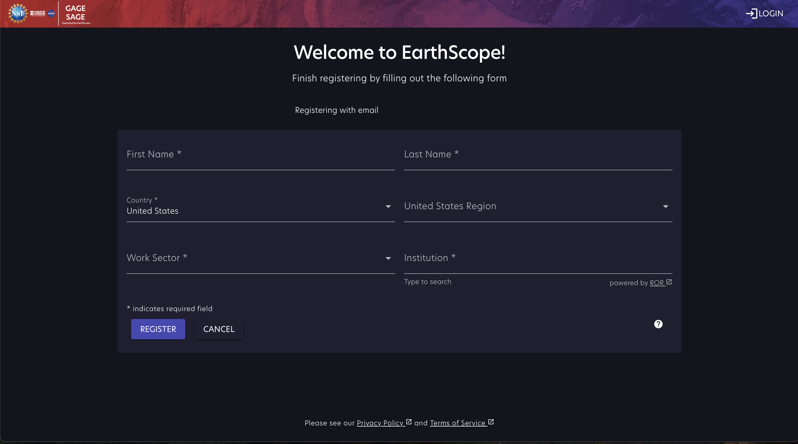

# EarthScope User Accounts

Welcome to EarthScope Cloud! 

To access most of our data and cloud tools, you will need a FREE user account.
Log in at https://earthscope.org/user

# Create an EarthScope Account

To start the registration process, navigate to https://earthscope.org/user . Select "Continue with Google" or "Continue with Cilogon," or if you prefer to use an email and password, click on the "Don't have an account? Sign Up" link instead.

Either option you choose will bring up a page that has several required fields to fill out: First Name, Last Name, Country, Work Sector, and Institution. If you are *not* currently affiliated with a research or educational institution, type "none" in this box and then click "Save".

Finally, click "Register" to complete the process. You may receive an account activation email. Please be aware that this email can take a while to find its way through some institutions' spam filters. Please contact your system administrator or try registering with a different email if you do not receive it and are unable to log in with your new account. 

# Credential and License Management 
API Access Credentials and real-time GNSS licenses can be managed on your user account page, https://www.earthscope.org/user/info. 